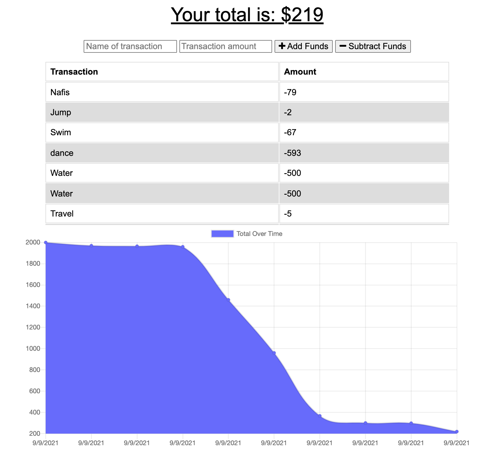

# HW19 Online/Offline Budget Tracker - Project

## Project Description

This is a Progressive Web Application (PWA). This application provides the user a platform to keep track of their expenses and overall tracks their budget when online and offline. This project will be developed using Git, MongoDB, NodeJS, NPM Modules, HTML5, Bootstrap, IndexedDB, Manifest, and Service Worker.

---

## Table of Content

1. [Project Description](https://github.com/Brondchux/hw18-fitness-tracker#project-description)
2. [Author Info](https://github.com/Brondchux/hw18-fitness-tracker#author-info)
3. [User Story](https://github.com/Brondchux/hw18-fitness-tracker#user-story)
4. [Acceptance Criteria](https://github.com/Brondchux/hw18-fitness-tracker#acceptance-criteria)
5. [Mock-Up Preview](https://github.com/Brondchux/hw18-fitness-tracker#mock-up-preview)
6. [Useful Links](https://github.com/Brondchux/hw18-fitness-tracker#useful-links)
7. [Tech Stack](https://github.com/Brondchux/hw18-fitness-tracker#tech-stack)
8. [Credits](https://github.com/Brondchux/hw18-fitness-tracker#credits)
9. [License](https://github.com/Brondchux/hw18-fitness-tracker#license)

---

## Author Info

Name: Gospel Chukwu

Email: hello@gospelchukwu.com

Portfolio: [www.gospelchukwu.com](https://brondchux.github.io/hw2-my-portfolio/)

---

## User Story

```md
AS an avid traveller
I WANT to be able to track my withdrawals and deposits with or without a data/internet connection
SO THAT my account balance is accurate when I am traveling.
```

---

## Acceptance Criteria

```md
GIVEN a user is on Budget App without an internet connection
WHEN the user inputs a withdrawal or deposit
THEN that will be shown on the page, and added to their transaction history when their connection is back online.
```

---

## Mock-Up Preview

The following photo shows a preview of the application when deployed



---

## Useful Links

1. 🗂 [Click me to view github repository for this project](https://github.com/Brondchux/hw18-fitness-tracker/)
2. 🌍 [Click me to view deployed application via heroku](https://live-hw18-fitness-tracker.herokuapp.com/)

---

## Tech Stack


---

## Credits

Appreciations to Ben 🙌🏾 of [Columbia University, Software Engineering Coding Boot Camp](https://bootcamp.cvn.columbia.edu/coding/landing-ftpt/?s=Google-Brand&msg_cv_scta=4&msg_cv_stbn=1&msg_cv_fcta=1&dki=Learn%20Coding&pkw=%2Bcolumbia%20%2Bcoding%20%2Bbootcamp&pcrid=471112563836&pmt=b&utm_source=google&utm_medium=cpc&utm_campaign=GGL%7CCOLUMBIA-UNIVERSITY%7CSEM%7CCODING%7C-%7COFL%7CTIER-1%7CALL%7CBRD%7CBMM%7CCore%7CBootcamp&utm_term=%2Bcolumbia%20%2Bcoding%20%2Bbootcamp&s=google&k=%2Bcolumbia%20%2Bcoding%20%2Bbootcamp&utm_adgroupid=111600049635&utm_locationphysicalms=9067609&utm_matchtype=b&utm_network=g&utm_device=c&utm_content=471112563836&utm_placement=&gclid=CjwKCAjwlrqHBhByEiwAnLmYUA8CIItksRJF6IT6XMX8WOOJBO-jtCRkzXZhI2gvsZrFEpYdRXy54RoC6jQQAvD_BwE&gclsrc=aw.ds) for being our tutor in this bootcamp.

Special thanks to [Google](https://www.google.com) for helping me find the accurate answers to my questions in a very timely manner.

---

## License

[](https://opensource.org/licenses/MIT)
